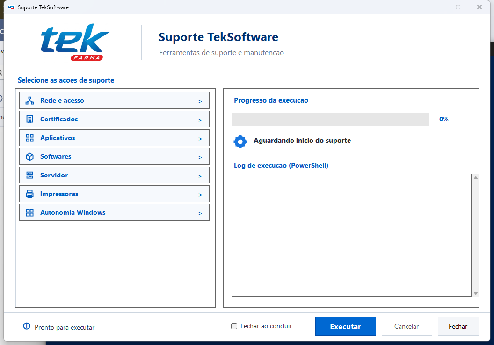
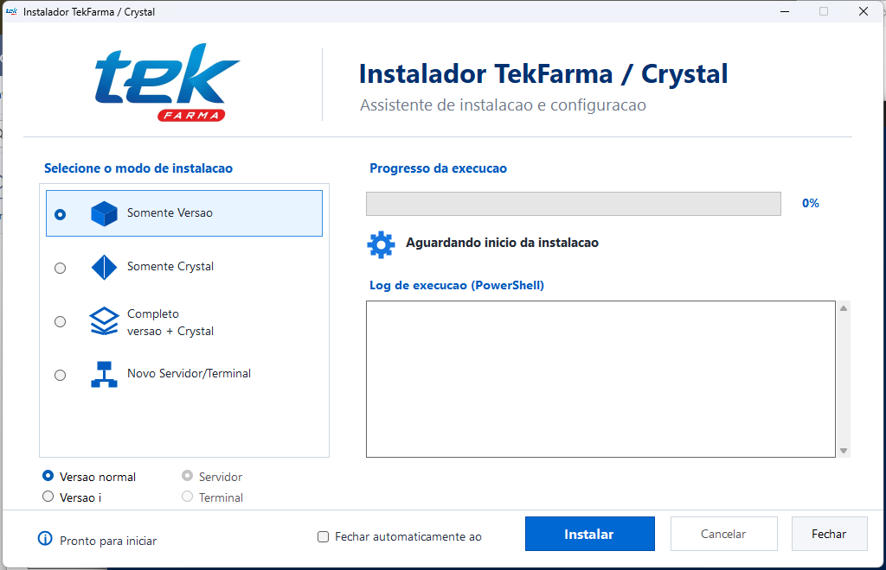

<div align="center">

# TEK Toolkit

**Instalação, atualização e suporte técnico automatizado para ambientes TekFarma**

[](instalar_tekfarma.ps1)
[](gui/TekFarmaInstallerGui.cs)
[](https://github.com/Nata-Felix/TEK-Toolkit/releases)

</div>

O **TEK Toolkit** transforma procedimentos extensos de implantação e suporte em fluxos guiados. Ele combina interfaces Windows com automações PowerShell para reduzir erros manuais e manter logs do atendimento.

| Central de suporte | Instalador TekFarma / Crystal |
| --- | --- |
|  |  |

## Principais recursos

- Instalação guiada para servidor e terminal.
- Atualização de versões do sistema com validação das etapas.
- Instalação e correção do Crystal Reports Runtime.
- Instalação de .NET Framework e Visual C++ Redistributable.
- Configuração e recuperação do Firebird.
- Preparação de rede, compartilhamentos SMB e mapeamentos.
- Suspensão e restauração controlada de compartilhamentos durante atualizações.
- Proteção dos processos do instalador durante o encerramento de aplicações em uso.
- Registro detalhado de sucesso, avisos e falhas para diagnóstico.

## Arquitetura

```text
install.ps1                    Bootstrap do instalador gráfico
instalar_tekfarma.ps1          Fluxo completo de instalação
suporte.ps1                    Bootstrap da central de suporte
suporte_teksoftware.ps1        Ações operacionais de suporte
gui/TekFarmaInstallerGui.cs    Interface do instalador
gui/TekSoftwareSuporteGui.cs   Interface da central de suporte
gui/build.ps1                  Compilação dos executáveis
```

## Execução

Instalador:

```powershell
irm https://raw.githubusercontent.com/Nata-Felix/TEK-Toolkit/refs/heads/main/install.ps1 | iex
```

Central de suporte:

```powershell
irm https://raw.githubusercontent.com/Nata-Felix/TEK-Toolkit/refs/heads/main/suporte.ps1 | iex
```

## Cache de downloads

Os instaladores e pacotes válidos são preservados em
`%TEMP%\TEK-Toolkit_Cache`. Ao repetir uma instalação interrompida, o
instalador procura primeiro nesse cache e nas pastas temporárias de execuções
anteriores.

- arquivos de Release podem ser reutilizados por até 30 dias;
- arquivos de versão e banco baixados do site TekFarma podem ser reutilizados
  por até 2 horas;
- a interface inicial pode ser reutilizada por até 15 minutos;
- scripts PowerShell são sempre baixados novamente;
- arquivos com sufixo `.partial` nunca são reutilizados.

Para forçar todos os downloads novamente, exclua a pasta
`%TEMP%\TEK-Toolkit_Cache`.

## Compilação

```powershell
powershell -NoProfile -ExecutionPolicy Bypass -File .\gui\build.ps1
```

## Cuidados de uso

O toolkit executa tarefas administrativas e foi criado para atendimento técnico controlado. Antes de usar, valide permissões, backups e compatibilidade com o ambiente de destino.

## Relação com a SOLPPE

Este projeto representa a aplicação especializada do trabalho desenvolvido sob a marca **SOLPPE — Solução Parceira Para Empresas** para o ecossistema TekFarma.
